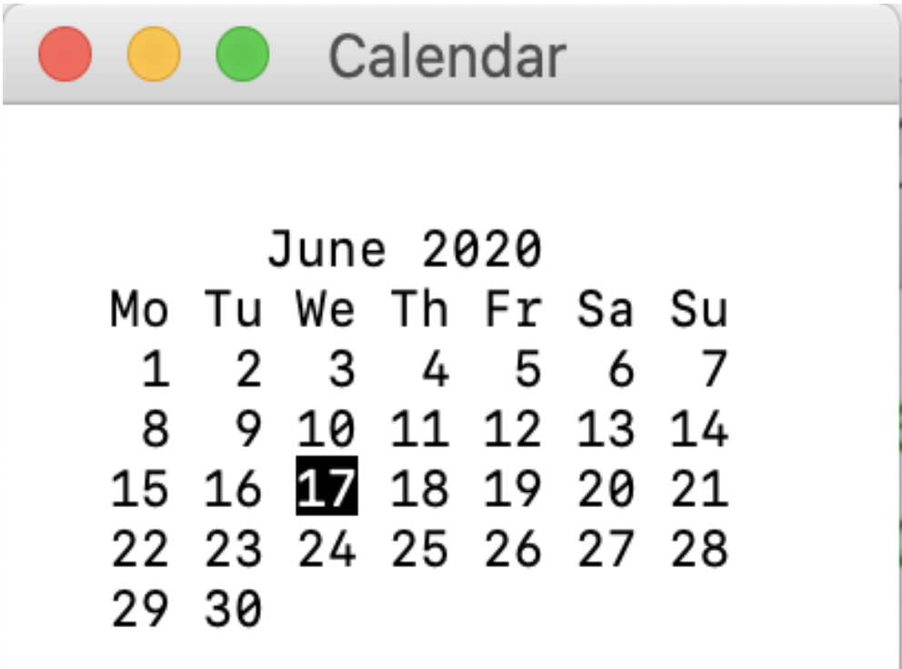
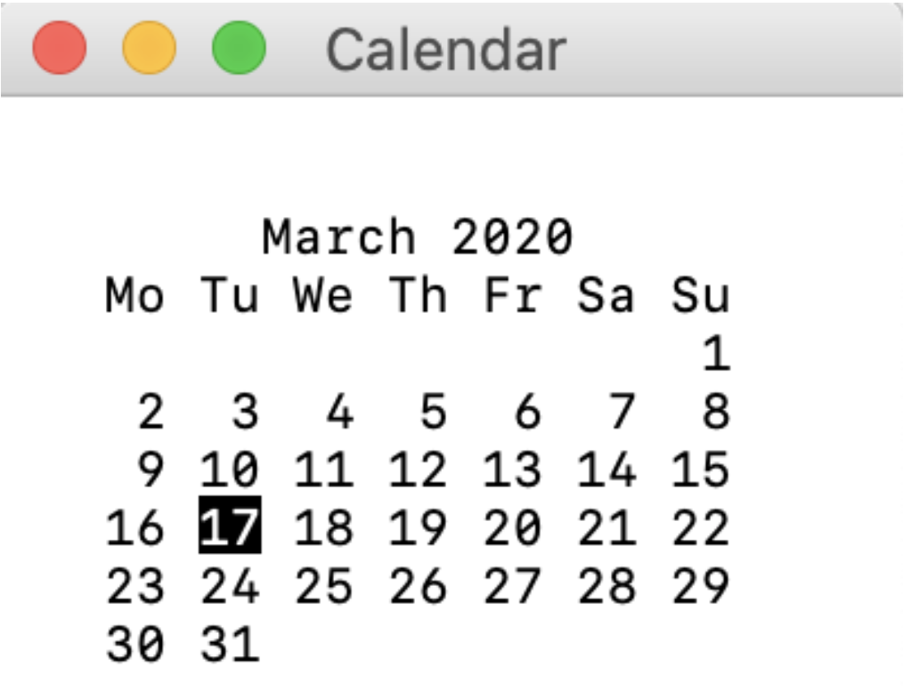
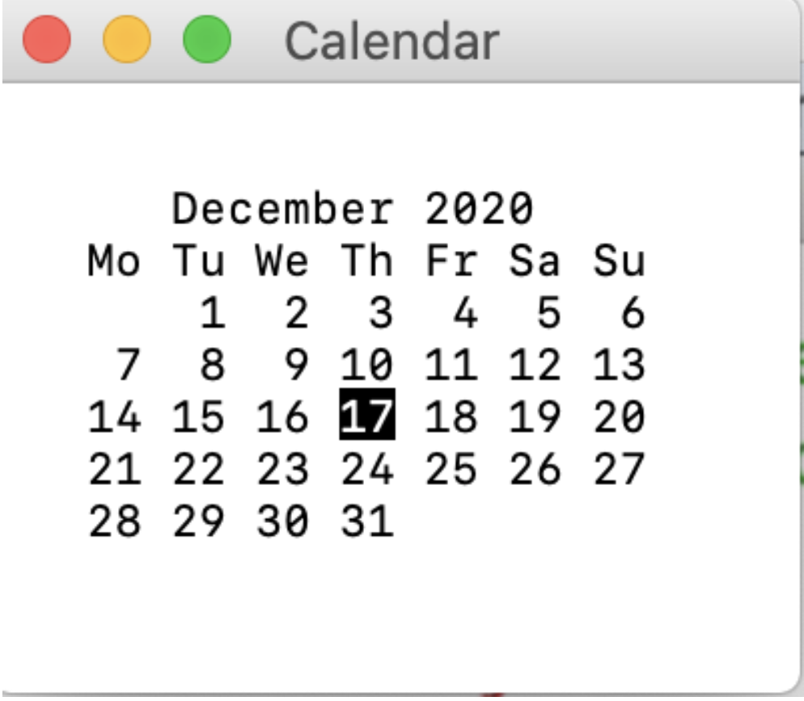
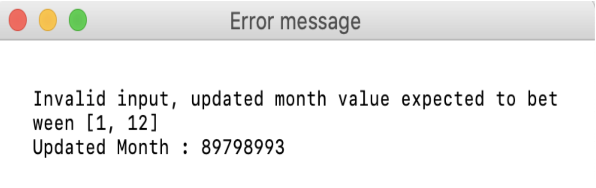

# advance_calendar

* This application was executed on 17th June 2020.

- This application is about printing the full month calendar, which highlights the current date. Besides this, the application also lets you to know the calendar of previous months or the coming months, thereby helping you in understanding the day    for the current date in either coming month or the previous months.

Instruction to run:

#### Displays the calendar of one month greater than current month, highlighting the current date.
* python advance_calendar.py

#### 1. python3 advance_calculator.py
   * Note: No command line arguments are being passed
   * Output:
   
   
#### 2. python3 advance_calculator.py -3
   * Note: Here -3 is being passed and the expected outcome should be the March Month
   * Output:
   

#### 3. python3 advance_calculator.py +6
   * Note: Here +6 is being passed and the expected outcome should be the December Month
   * Output:
   

#### 4. python3 advance_calendar.py 89798987
   * Note: Here the input is beyond +12 Output:
   

#### 5. python3 advance_calendar.py hkhfjdhk
   * Note: Here the input parameter is not number
   * Output:
    

#### 6. python3 advance_calendar.py -help
 
